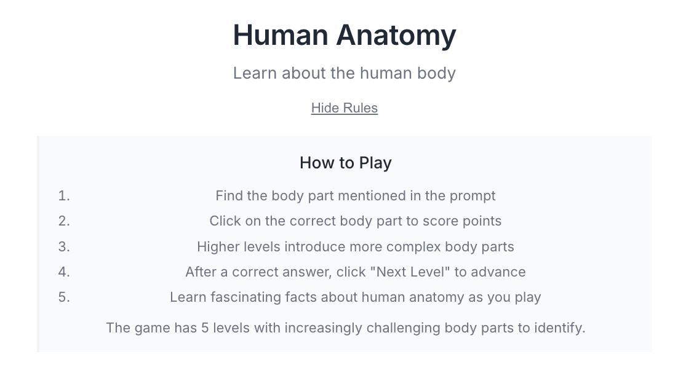

# Human Anatomy Game

A clean, minimalist educational game to learn about human anatomy.

[](https://github.com/synthara-company/anatomy_game)
[](https://www.php.net/)
[](https://www.apple.com/macos/)


*Screenshot of the Human Anatomy Game showing the clean, minimalist interface*

## Overview

This interactive web-based game helps users learn about human anatomy by identifying different body parts. The game features:

- 5 progressive difficulty levels
- Educational facts about each body part
- Clean, distraction-free interface
- Responsive design that works on various devices

## Requirements

To run this game, you'll need:

- PHP 7.4 or higher
- A web browser (Chrome, Firefox, Safari, or Edge)

## Installation & Setup

### Option 1: Clone from GitHub and use PHP's built-in server (easiest)

1. Make sure PHP is installed on your computer. You can check by running:
   ```
   php -v
   ```
   If PHP is not installed, download and install it from [php.net](https://www.php.net/downloads.php) or use a package manager:
   - **macOS**: `brew install php`
   - **Windows**: Use [XAMPP](https://www.apachefriends.org/index.html) or [WampServer](https://www.wampserver.com/en/)
   - **Linux**: `sudo apt install php` (Ubuntu/Debian) or `sudo yum install php` (CentOS/RHEL)

2. Make sure Git is installed on your computer. You can check by running:
   ```
   git --version
   ```
   If Git is not installed, download and install it from [git-scm.com](https://git-scm.com/downloads) or use a package manager:
   - **macOS**: `brew install git`
   - **Windows**: Download from [git-scm.com](https://git-scm.com/download/win)
   - **Linux**: `sudo apt install git` (Ubuntu/Debian) or `sudo yum install git` (CentOS/RHEL)

3. Clone the repository from GitHub:
   ```
   git clone https://github.com/synthara-company/anatomy_game.git
   ```

4. Open a terminal/command prompt and navigate to the cloned game directory:
   ```
   cd anatomy_game
   ```

4. Start the PHP development server:
   ```
   php -S localhost:8000
   ```

5. Open your web browser and go to:
   ```
   http://localhost:8000/anatomy_game.php
   ```

### Option 2: Clone from GitHub and use a web server (Apache, Nginx, etc.)

1. Install a web server like Apache or Nginx with PHP support.
   - **XAMPP** (Windows/macOS/Linux): [apachefriends.org](https://www.apachefriends.org/index.html)
   - **MAMP** (macOS): [mamp.info](https://www.mamp.info/)
   - **WampServer** (Windows): [wampserver.com](https://www.wampserver.com/)

2. Make sure Git is installed (see Option 1 for instructions).

3. Clone the repository directly into your web server's document root:
   - XAMPP:
     ```
     cd /path/to/xampp/htdocs
     git clone https://github.com/synthara-company/anatomy_game.git
     ```
   - MAMP:
     ```
     cd /Applications/MAMP/htdocs  # macOS path, adjust if needed
     git clone https://github.com/synthara-company/anatomy_game.git
     ```
   - WampServer:
     ```
     cd C:\wamp64\www  # Windows path, adjust if needed
     git clone https://github.com/synthara-company/anatomy_game.git
     ```
   - Standard Apache:
     ```
     cd /var/www/html  # Linux path, adjust if needed
     sudo git clone https://github.com/synthara-company/anatomy_game.git
     ```

4. Start your web server according to its documentation.

5. Open your web browser and navigate to:
   ```
   http://localhost/anatomy_game/anatomy_game.php
   ```
   (The exact URL may vary depending on your web server configuration)

## How to Play

1. The game will display a human body outline with various labeled parts
2. Read the prompt asking you to find a specific body part
3. Click on the correct body part to score points
4. After a correct answer, click "Next Level" to advance
5. The game has 5 levels with increasingly challenging body parts to identify

## Design Philosophy

The Human Anatomy Game follows a minimalist design approach with these principles:

- **Clean Typography**: Carefully selected font sizes and weights for optimal readability
- **Reduced Visual Noise**: No unnecessary decorative elements or distractions
- **Focused Interface**: Only essential elements are displayed to maintain focus on learning
- **Harmonious Spacing**: Consistent spacing creates a balanced, harmonious layout
- **Subtle Color Palette**: Limited color usage with purpose-driven accent colors

## Troubleshooting

- **Blank page**: Make sure PHP is running correctly and has permission to read the game files
- **Session errors**: Ensure PHP has write permissions to create session files
- **Display issues**: Try a different browser or clear your browser cache

## Contributing

Contributions to improve the game are welcome! Here's how you can contribute:

1. Fork the repository on GitHub
2. Clone your fork: `git clone https://github.com/YOUR-USERNAME/anatomy_game.git`
3. Create a new branch: `git checkout -b feature/your-feature-name`
4. Make your changes and commit them: `git commit -m 'Add some feature'`
5. Push to the branch: `git push origin feature/your-feature-name`
6. Submit a pull request

## License

This game is provided for educational purposes. The human body illustrations are from public domain sources.

## Release History

### v1.0.0 (April 13, 2025)

**Initial Release**
- Basic anatomy game with 5 difficulty levels
- Simple UI with basic styling
- Core gameplay mechanics implemented

### v1.1.0 (April 13, 2025)

**Enhanced User Experience**
- Improved typography and visual design
- Added more fascinating anatomy facts
- Enhanced body part descriptions
- Added visual feedback for correct/incorrect answers

### v1.2.0 (April 13, 2025)

**Refined Interface**
- Implemented clean, minimalist design principles
- Optimized typography for better readability
- Reduced visual noise and distractions
- Created harmonious spacing and layout
- Added full-screen mode for better immersion
- Improved color palette for visual harmony

### v1.3.0 (Current)

**Documentation and Accessibility**
- Added comprehensive README with installation instructions
- Included gameplay screenshot for visual reference
- Added design philosophy documentation
- Improved accessibility with better contrast ratios
- Added contributing guidelines
- Optimized for different screen sizes

## Credits

Created as an educational tool for learning human anatomy by [Synthara Company](https://github.com/synthara-company).
